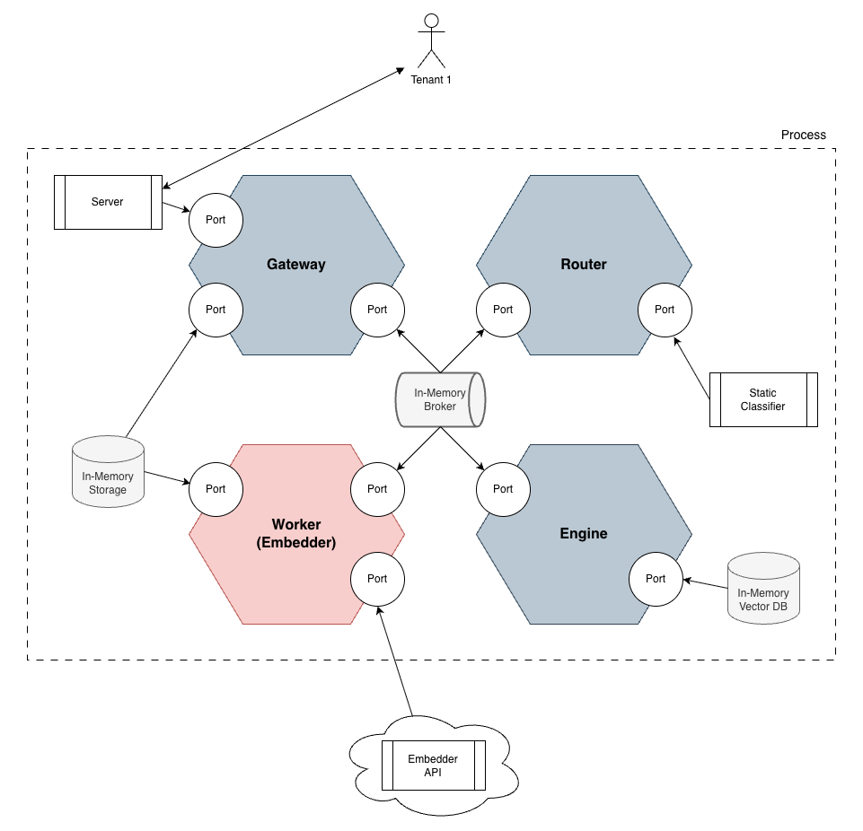
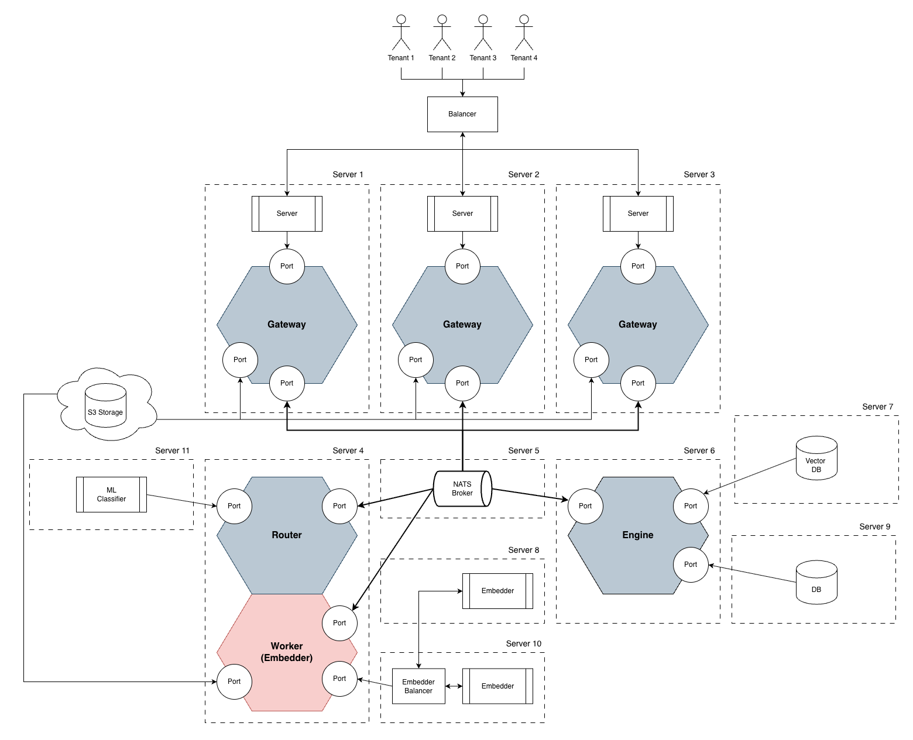
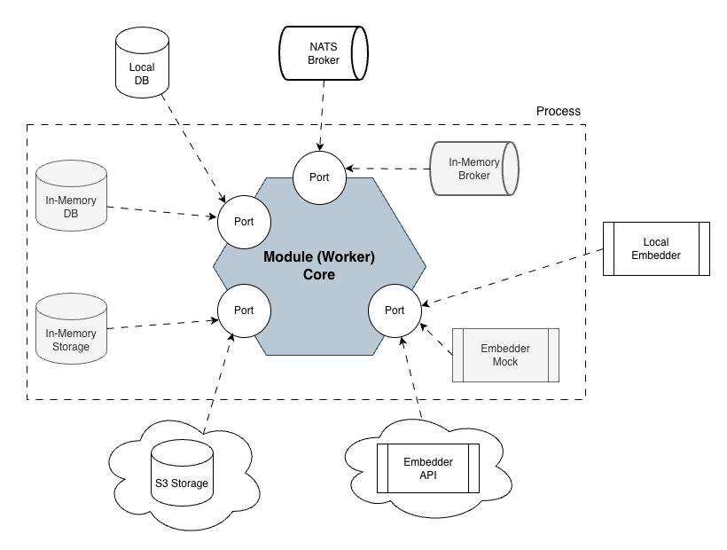
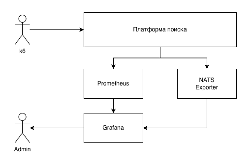

<h1 align="center">Morphic Monad</h1>

<p align="center">
  <strong>Production-Ready, Event-Driven Multimodal Search & RAG Platform</strong>
</p>

<p align="center">
  <a href="#features">Features</a> •
  <a href="#architecture">Architecture</a> •
  <a href="#quick-start">Quick Start</a> •
  <a href="#api-usage">API Usage</a> •
  <a href="#observability">Observability</a>
</p>

---

**Morphic Monad** is a highly scalable, event-driven platform designed to bridge the gap between in-memory AI prototypes (like LangChain or LlamaIndex) and high-load, enterprise-grade distributed systems.

It provides an infinitely scalable backbone for multimodal semantic search, B2B AI agents, and corporate knowledge bases.

## ✨ Why Morphic Monad?

In-memory RAG frameworks work great for prototypes, but they fail in production: heavy multimodal files block execution threads, components cannot be scaled independently, and B2B multitenancy requires deploying expensive isolated clusters.

**We solve this through:**

* 🧬 **Infrastructural Polymorphism:** Run the exact same business logic as a single zero-dependency binary (for local dev/testing) OR as a fully distributed Kubernetes microservices cluster (for high-load production) simply by changing the configuration.
* 🏢 **Stateless Multitenancy Out-of-the-Box:** Strict logical isolation. Tenant context is injected directly into the NATS event envelope. Worker nodes remain completely stateless, eliminating the risk of cross-tenant data leakage.
* 📦 **Claim Check Pattern for Transport:** Heavy multimodal files (images, PDFs) never clog the message broker. They are automatically offloaded to S3-compatible Blob Storage, and only lightweight URIs are passed through the event bus.
* ⚡ **Event-Driven Orchestration:** Built on top of **NATS JetStream**, enabling asynchronous, non-blocking execution pipelines and infinite horizontal scaling of individual worker nodes.
* 🧠 **Modular & Isolated:** Hexagonal architecture ensures that any ML model (OpenAI, Ollama, local ONNX) or tool can be swapped instantly without affecting the core engine.

## 🏗 Architecture

### 1. The Concept of Infrastructural Polymorphism
By leveraging Hexagonal Architecture, the application ports dynamically adapt to the environment.

**Local / Monolith Mode:** Uses embedded NATS, In-Memory Blob Storage, and In-Memory VectorDB. Runs in a single process.


**Distributed / Microservices Mode:** Uses external NATS cluster, AWS S3, and external VectorDB. Scales infinitely.


### 2. High-Load Scaling & Multitenancy
Workers can be spawned infinitely. The Gateway handles ingress, and the Router orchestrates the pipeline based on event types.


## 🚀 Quick Start

Ensure you have Go 1.25+ and Docker installed.

### Option A: Local Monolith (Zero Dependencies)
Perfect for local development, testing, and debugging. Starts an embedded NATS server and uses in-memory storage.
```bash
make run-mono
```

### Option B: Distributed Microservices (Production Ready)
Starts the NATS JetStream broker, S3 (LocalStack), Prometheus, Grafana, and all microservices (Gateway, Router, Engine, Embedder) as independent containers.
```bash
make full-up
```

## 🔌 API Usage

The Gateway service exposes a REST API (default port `8080`). Note that all requests **require** the `X-Tenant-ID` header.

### 1. Ingest Text (Automatic Claim Check)
```bash
curl -X POST http://localhost:8080/v1/ingest \
  -H "X-Tenant-ID: my-corporate-tenant" \
  -F "context_text=Morphic Monad is a distributed semantic search platform."
```

### 2. Ingest Heavy Multimodal Files
Files are automatically saved to S3, and only their URI is passed to the embedding workers.
```bash
echo "Important corporate document content" > file.txt

curl -X POST http://localhost:8080/v1/ingest \
  -H "X-Tenant-ID: my-corporate-tenant" \
  -F "context_text=Document description" \
  -F "file=@file.txt"
```

### 3. Semantic Search
Search is strictly isolated by `Tenant-ID`.
```bash
curl -X POST http://localhost:8080/v1/search \
  -H "X-Tenant-ID: my-corporate-tenant" \
  -H "Content-Type: application/json" \
  -d '{"query_text": "What is Morphic?", "top_k": 3}'
```

## 📊 Observability & Load Testing

The platform is instrumented with Prometheus metrics. Running `make full-up` automatically provisions a Grafana dashboard.

* **Grafana:** `http://localhost:3000` (Anonymous Admin access enabled)
* **Prometheus:** `http://localhost:9091`



We provide built-in `k6` load testing scripts to benchmark the Claim Check pattern and Event Bus throughput:
```bash
k6 run scripts/load/poly_test.js
```

## 🎓 Academic Backing & Validation

The architecture of this platform is not just theoretical; it is backed by rigorous academic research at NUST MISIS.
* Resulted in **3 scientific publications**.
* Protected by a **State Registered Software Patent** (№ 2026660789) for the event-log routing gateway.
